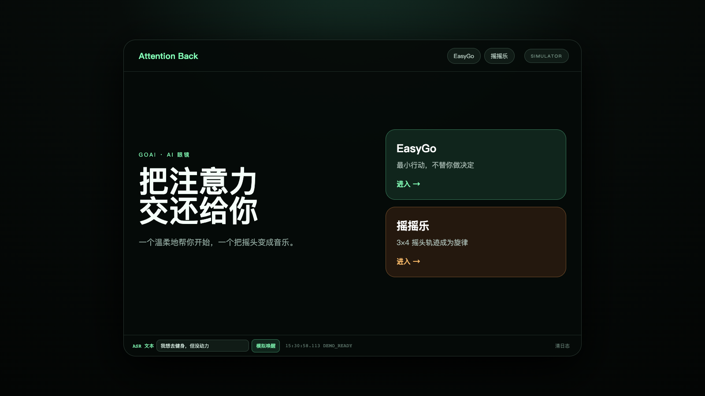
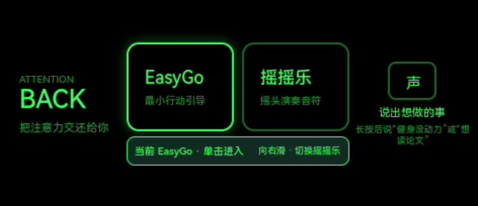
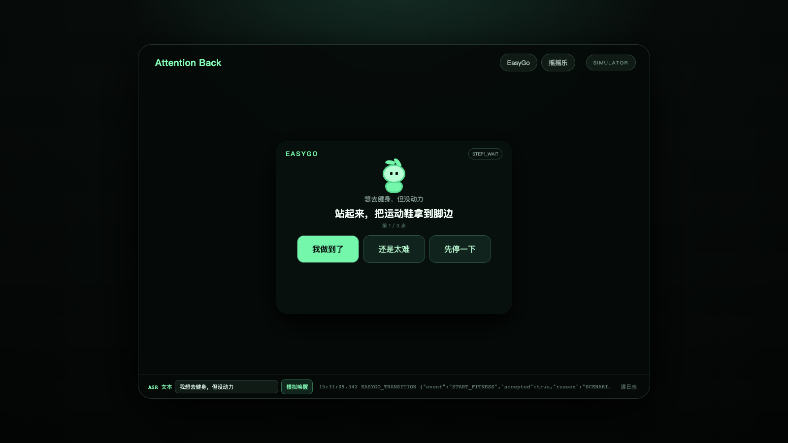
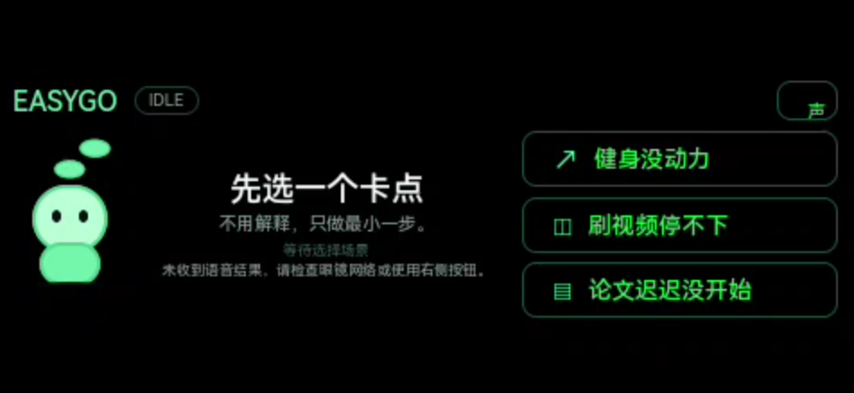
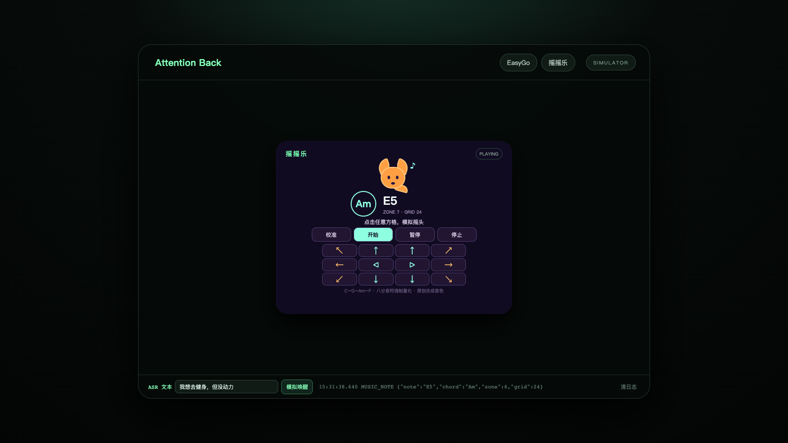
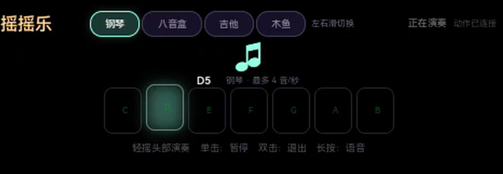
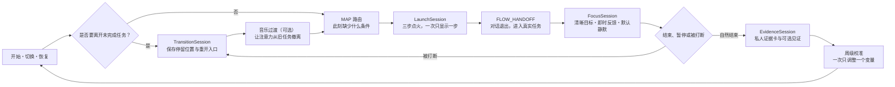
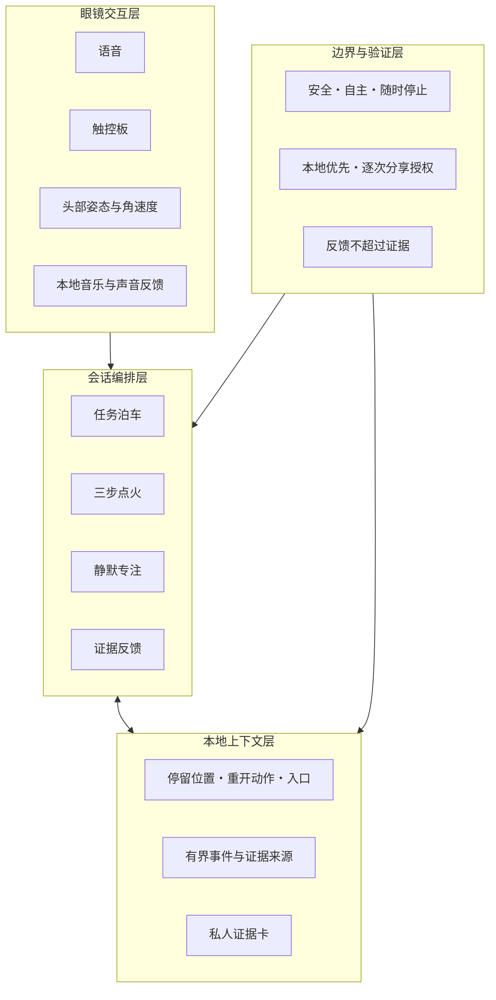

# Attention Back

> 让重要的事真正开始，也让每次切换有一个干净的结束。

**真实页面截图**

有些目标一直放在心里：想开始锻炼，想学完一门课，想把拖了很久的作品做出来。它们并不是不重要，只是第一步迟迟没有发生。

还有一种更隐蔽的消耗。人已经切到下一件事，注意力却留在上一封邮件、上一段视频或上一场会议里。任务换了，大脑没有跟上。

Attention Back 是为这两个时刻设计的 AI 眼镜应用。它以 Rokid AIUI 为主要载体，通过语音、触控、头部姿态和本地声音完成低负担交互：EasyGo 陪用户把长期目标变成眼前能做的一步；摇摇乐用一小段由头部动作生成的音乐，为任务切换留出过渡。它不替用户管理人生，只在最容易卡住的地方搭一下手。

README 描述的是 Attention Back 希望走向的完整产品形态，也是后续设计与开发共同对齐的目标。

## 两个入口，一条完整路径

### EasyGo：一次只处理眼前这一步

**真实页面截图**

### 摇摇乐：用轻微动作和音乐完成切换

**真实页面截图**

EasyGo 不是待办清单。用户说出一个想开始却一直没开始的目标后，它先判断此刻真正缺的是什么，再给出一个立刻能做、做完可以停下的动作。用户觉得太难，它就缩小当前一步；用户想暂停，这一轮就停在这里，不清零，也不留下“欠账”。

摇摇乐也不是体感游戏。轻微的左右或上下动作会落到稳定节拍中，形成可以听见的反馈。音乐在这里是一段有边界的切换仪式：先把上一件事收住，再把注意力交给下一件事。

两者最终汇合成一条路径：保存旧任务的恢复线索，启动新目标，安静进入真实任务，最后把真正发生过的行动还给用户看。

## 怎么使用

### 观看备选提交视频

[下载或播放 1080p 浏览器模拟演示](./video/attention-back-submission-backup-20260816-153057.mp4)

这段视频自动完成 EasyGo 与摇摇乐两条演示路径，属于浏览器模拟备选材料，不替代真机画面、真实 IMU、眼镜声音与佩戴体验证据。

### 开始一个拖了很久的目标

1. 对眼镜说出想开始的事，例如“我想开始健身，但一直没动力”。
2. EasyGo 只展示当前动作，不一次抛出整套计划。
3. 做到了就继续；觉得太难就缩小这一步；想停可以直接暂停。
4. 第三步把用户送到真实任务入口后，对话结束，应用进入安静状态，不再追问“完成了吗”。

### 从一件事切到另一件事

1. 先把旧任务停在哪里、回来先做什么记下来。
2. 如果脑子还留在上一件事里，进入摇摇乐，用一小段音乐完成过渡。
3. 离开音乐后，只接收新任务的第一个动作。

### 回到被打断的任务

打开任务泊车卡，直接看到上次停留的位置、回来先做的动作，以及文档、标签页或页面入口。恢复不需要重新回忆整段上下文。

## 产品怎样运转

Attention Back 把一次使用拆成三个时间尺度：几秒钟完成任务切换和启动，几分钟留给真实工作，一周看一次长期变化。中间由四个职责清楚的会话接力。

| 组成 | 它负责什么 |
| --- | --- |
| `TransitionSession` | 在离开旧任务前保存停留位置、一个悬而未决的问题和最短重开动作。用户可以跳过，不会被阻挡。 |
| 音乐过渡 | 接收头部姿态与动作，把动作量化成节拍内的音符，为上下文切换提供即时、低语言负担的反馈。 |
| MAP 路由 | 检查此刻的提示是否合适、动作是否做得到，以及用户是否真的认同目标。MAP 是诊断工具，不是意志力评分。 |
| `LaunchSession` | 保留 `ignition → bridge → commit` 三步结构；只处理当前一步，没有第四步。 |
| `FLOW_HANDOFF` | 把第三步交给真实目标。它只表示交接已经发生，不冒充任务已经完成。 |
| `FocusSession` | 保持一个清晰的近端目标和低干扰环境。默认安静，不用计时器宣称用户进入了心流。 |
| `EvidenceSession` | 在自然停下后记录关键行动，生成私人证据卡，并让用户决定是否交给 AI 或自己选择的人见证。 |

## 方案架构

眼镜负责低负担交互，会话编排层负责判断此刻该出现什么，本地上下文层负责记住用户不该反复记住的东西。安全、隐私和证据真实性不是最后补上的条款，而是每次状态转换都要经过的边界。

## 设计理念

### 一次只出现一步

行动困难时，更多计划通常只会增加阻力。EasyGo 每轮只展示当前动作。动作必须足够具体，能被观察，也要和目标方向一致。

### 产品最终要消失

三步的目的不是让用户留在应用里，而是把人送回真实任务。进入专注后，界面和对话都应该安静下来。

### 暂停不是失败

用户可以说太难、暂停、退出，也可以跳过任务泊车。这些都是有效选择。产品不使用断签、排行榜、补债或公开羞辱逼人继续。

### 只确认真正发生的事

Attention Back 区分三类证据：用户自报、应用观察、产物验证。用户说“完成了”，系统可以确认这次自报，但不能改写成“系统已经验证质量合格”。反馈要具体，也不能超过证据。

### 默认只让自己看见

行动记录首先属于用户。私人证据卡默认只在本地保存；AI 见证基于具体事件复述；真人见证需要用户逐次选择内容和接收人。暂停、拒绝和未完成不会被自动分享。

### 不把计时当作心流

应用可以准备清晰目标、即时反馈和合适挑战，却不能从前台时长或无操作状态判断一个人是否进入心流。行为效果需要真实用户研究回答，不能由界面或测试结果替代。

## 我们想留下什么

Attention Back 不打算把人的一天变成连续打卡。它想留下的是更朴素的东西：这个目标开始过，这一步被主动缩小过，这次暂停之后又回来过，这段工作确实形成了一个可以看见的结果。

长期目标不再只是一句“以后要做”。下一次切换，也不必把上一件事一起带走。
